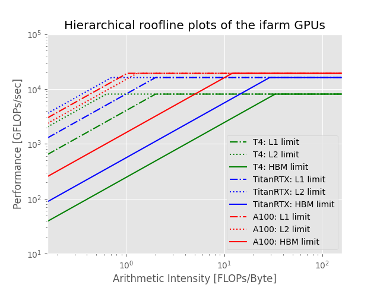

# Roofline Plots of the Hardware Limits

Table: a quick roofline view of the ifarm GPUs (the L1/L2 BW numbers might be updated in the future).

| GPU Product                               |   Tesla T4 |   Titan RTX | A100_PCIe |
|:------------------------------------------|-----------:|------------:|----------:|
| Compute capacity                          |        7.5 |         7.5 |       8.0 |
| Boost GPU core clock (MHz)                |       1590 |        1770 |      1410 |
| # SM                                      |         40 |          72 |       108 |
| Theoretical F32 FMA performance (TFlops)  |       8.14 |       16.31 |     19.49 |
| Measured F32 FMA performance (TFlops)     |       8.10 |       16.20 |     19.37 |
| Memory size (MB)                          |      15110 |       24220 |     81251 |
| Memory clock (MHz)                        |       5001 |        7001 |      1512 |
| Memory bus width (bits)                   |        256 |         384 |      5120 |
| Theoretical peak memory BW (GB/s)         |     320.06 |      672.10 |   1935.36 |
| Measured peak memory BW (GB/s)            |      245.2 |       558.7 |    1607.3 |	
| L2 cache size (Mebibyte)                  |          4 |           6 |        40 |
| Measured L2 bandwidth (GB/s)              |    12866.6 |     22774.0 |   14970.5 |	
| L1 cache size (Kilibyte) per SM           |         64 |          64 |       164 |
| Measured L1 bandwidth (GB/s)              |     4051.9 |      8124.2 |   18843.7 |




## Methods and Reference

The results are based on the GPU micro-benchmarking set at https://github.com/shen203/GPU_Microbenchmark.

The bibtex information of the [referred publication](https://arxiv.org/pdf/1804.06826.pdf) is as below.

```bibtex
@article{jia2018dissecting,
  title={{Dissecting the NVIDIA volta GPU architecture via microbenchmarking}},
  author={Jia, Zhe and Maggioni, Marco and Staiger, Benjamin and Scarpazza, Daniele P},
  howpublished = {\url{https://arxiv.org/pdf/1804.06826.pdf}},
  year={2018}
}
```


